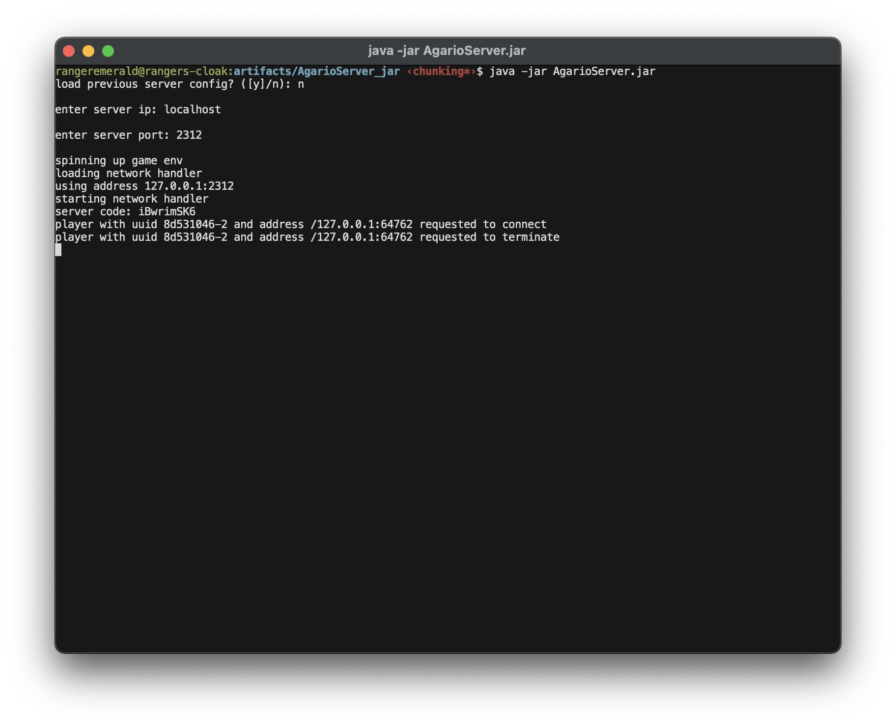

# AgarioServer

A Java server-implementation clone of the popular 2010's online game [Agar.io](agar.io).

See [AgarioClient](https://github.com/TheMoonThatRises/AgarioClient) for the client companion of this server.

## Prerequisites

- Minimum UDP packet size of `65_534` bytes
- Fast and reliable upload/download speeds
- Recent CPU model (required for proper physics processing speeds and networking)

## Building

Much of the codebase uses bleeding-edge functions and syntax.

Tested Environment:

- ZuluFX 23
- IntelliJ IDEA
- MacOS 15.1
- Ubuntu 22.04
- 1 GB upload/download

`main` is located in the class `Server` and can be run using IntelliJ's "run" arrow.

## Multiplayer

Share the `server code` with players (`IP address` and `port` is possible, but not recommended). Fast upload speed is required for a continuous stream of game updates to every player. Connected players are displayed on the console along with their IP address, port, and UUID.

## Roadmap

- [] More efficient network use
- [] Constant physics speed during low TPS
- [] Allow for PNG custom skins
- [] More consistent physics with original agar.io
